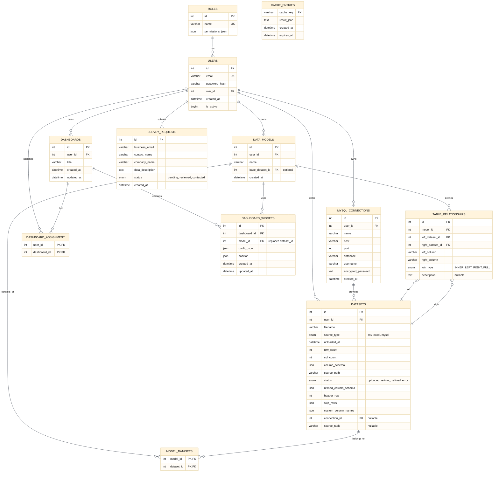
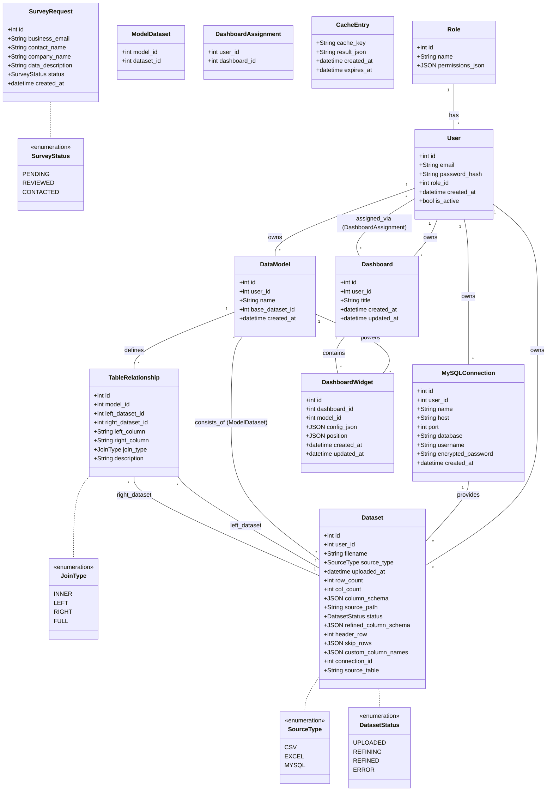

# ERD DIAGRAM

```mermaid
%%{init: {'theme': 'base', 'themeVariables': {
  'fontFamily': 'Arial',
  'primaryTextColor': '#111111',
  'lineColor': '#1f2937',
  'tertiaryColor': '#ffffff',
  'background': '#ffffff'
}}}%%
erDiagram
    USERS ||--o{ DASHBOARDS : owns
    USERS ||--o{ DATASETS : owns
    USERS ||--o{ MYSQL_CONNECTIONS : owns
    USERS ||--o{ DATA_MODELS : owns
    USERS ||--o{ SURVEY_REQUESTS : submits
    USERS ||--o{ DASHBOARD_ASSIGNMENT : assigned
    DASHBOARDS ||--o{ DASHBOARD_ASSIGNMENT : has
    ROLES ||--o{ USERS : has
    MYSQL_CONNECTIONS ||--o{ DATASETS : provides
    DASHBOARDS ||--o{ DASHBOARD_WIDGETS : contains
    DATA_MODELS ||--o{ DASHBOARD_WIDGETS : uses
    DATA_MODELS ||--o{ MODEL_DATASETS : consists_of
    DATASETS ||--o{ MODEL_DATASETS : belongs_to
    DATA_MODELS ||--o{ TABLE_RELATIONSHIPS : defines
    TABLE_RELATIONSHIPS }o--|| DATASETS : left
    TABLE_RELATIONSHIPS }o--|| DATASETS : right

    USERS {
        int id PK
        varchar email UK
        varchar password_hash
        int role_id FK
        datetime created_at
        tinyint is_active
    }

    ROLES {
        int id PK
        varchar name UK
        json permissions_json
    }

    MYSQL_CONNECTIONS {
        int id PK
        int user_id FK
        varchar name
        varchar host
        int port
        varchar database
        varchar username
        text encrypted_password
        datetime created_at
    }

    DATASETS {
        int id PK
        int user_id FK
        varchar filename
        enum source_type "csv, excel, mysql"
        datetime uploaded_at
        int row_count
        int col_count
        json column_schema
        varchar source_path
        enum status "uploaded, refining, refined, error"
        json refined_column_schema
        int header_row
        json skip_rows
        json custom_column_names
        int connection_id FK "nullable"
        varchar source_table "nullable"
    }

    DATA_MODELS {
        int id PK
        int user_id FK
        varchar name
        int base_dataset_id FK "optional"
        datetime created_at
    }

    MODEL_DATASETS {
        int model_id PK,FK
        int dataset_id PK,FK
    }

    TABLE_RELATIONSHIPS {
        int id PK
        int model_id FK
        int left_dataset_id FK
        int right_dataset_id FK
        varchar left_column
        varchar right_column
        enum join_type "INNER, LEFT, RIGHT, FULL"
        text description "nullable"
    }

    DASHBOARDS {
        int id PK
        int user_id FK
        varchar title
        datetime created_at
        datetime updated_at
    }

    DASHBOARD_ASSIGNMENT {
        int user_id PK,FK
        int dashboard_id PK,FK
    }

    DASHBOARD_WIDGETS {
        int id PK
        int dashboard_id FK
        int model_id FK "replaces dataset_id"
        json config_json
        json position
        datetime created_at
        datetime updated_at
    }

    CACHE_ENTRIES {
        varchar cache_key PK
        text result_json
        datetime created_at
        datetime expires_at
    }

    SURVEY_REQUESTS {
        int id PK
        varchar business_email
        varchar contact_name
        varchar company_name
        text data_description
        enum status "pending, reviewed, contacted"
        datetime created_at
    }
```

# Class Diagram

```mermaid
classDiagram
    direction TB

    %% ENUMERATIONS
    class SourceType {
        <<enumeration>>
        CSV   
        EXCEL
        MYSQL
    }

    class DatasetStatus {
        <<enumeration>>
        UPLOADED
        REFINING
        REFINED
        ERROR
    }

    class JoinType {
        <<enumeration>>
        INNER
        LEFT
        RIGHT
        FULL
    }

    class SurveyStatus {
        <<enumeration>>
        PENDING
        REVIEWED
        CONTACTED
    }

    %% ENTITY CLASSES
    class User {
        +int id
        +String email
        +String password_hash
        +int role_id
        +datetime created_at
        +bool is_active
    }

    class Role {
        +int id
        +String name
        +JSON permissions_json
    }

    class MySQLConnection {
        +int id
        +int user_id
        +String name
        +String host
        +int port
        +String database
        +String username
        +String encrypted_password
        +datetime created_at
    }

    class Dataset {
        +int id
        +int user_id
        +String filename
        +SourceType source_type
        +datetime uploaded_at
        +int row_count
        +int col_count
        +JSON column_schema
        +String source_path
        +DatasetStatus status
        +JSON refined_column_schema
        +int header_row
        +JSON skip_rows
        +JSON custom_column_names
        +int connection_id
        +String source_table
    }

    class DataModel {
        +int id
        +int user_id
        +String name
        +int base_dataset_id
        +datetime created_at
    }

    class ModelDataset {
        +int model_id
        +int dataset_id
    }

    class TableRelationship {
        +int id
        +int model_id
        +int left_dataset_id
        +int right_dataset_id
        +String left_column
        +String right_column
        +JoinType join_type
        +String description
    }

    class Dashboard {
        +int id
        +int user_id
        +String title
        +datetime created_at
        +datetime updated_at
    }

    class DashboardAssignment {
        +int user_id
        +int dashboard_id
    }

    class DashboardWidget {
        +int id
        +int dashboard_id
        +int model_id
        +JSON config_json
        +JSON position
        +datetime created_at
        +datetime updated_at
    }

    class CacheEntry {
        +String cache_key
        +String result_json
        +datetime created_at
        +datetime expires_at
    }

    class SurveyRequest {
        +int id
        +String business_email
        +String contact_name
        +String company_name
        +String data_description
        +SurveyStatus status
        +datetime created_at
    }

    %% ASSOCIATIONS & RELATIONSHIPS
    Role "1" -- "*" User : has
    User "1" -- "*" Dashboard : owns
    User "1" -- "*" Dataset : owns
    User "1" -- "*" MySQLConnection : owns
    User "1" -- "*" DataModel : owns
    User "*" -- "*" Dashboard : assigned_via (DashboardAssignment)

    MySQLConnection "1" -- "*" Dataset : provides
    
    DataModel "1" -- "*" DashboardWidget : powers
    Dashboard "1" -- "*" DashboardWidget : contains

    DataModel "*" -- "*" Dataset : consists_of (ModelDataset)
    DataModel "1" -- "*" TableRelationship : defines
    
    TableRelationship "*" -- "1" Dataset : left_dataset
    TableRelationship "*" -- "1" Dataset : right_dataset

    %% ENUM DEPENDENCIES
    Dataset .. SourceType
    Dataset .. DatasetStatus
    TableRelationship .. JoinType
    SurveyRequest .. SurveyStatus
```